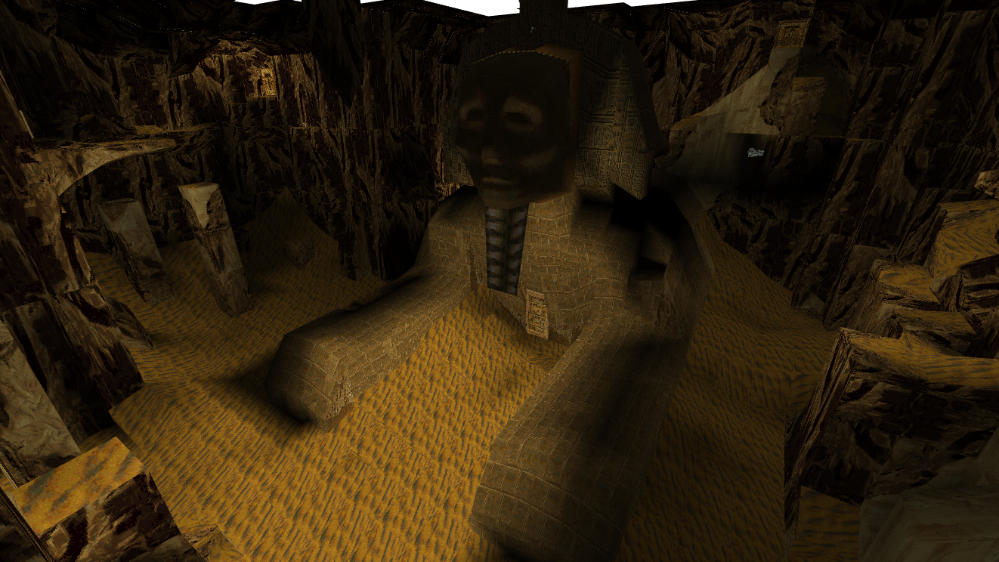
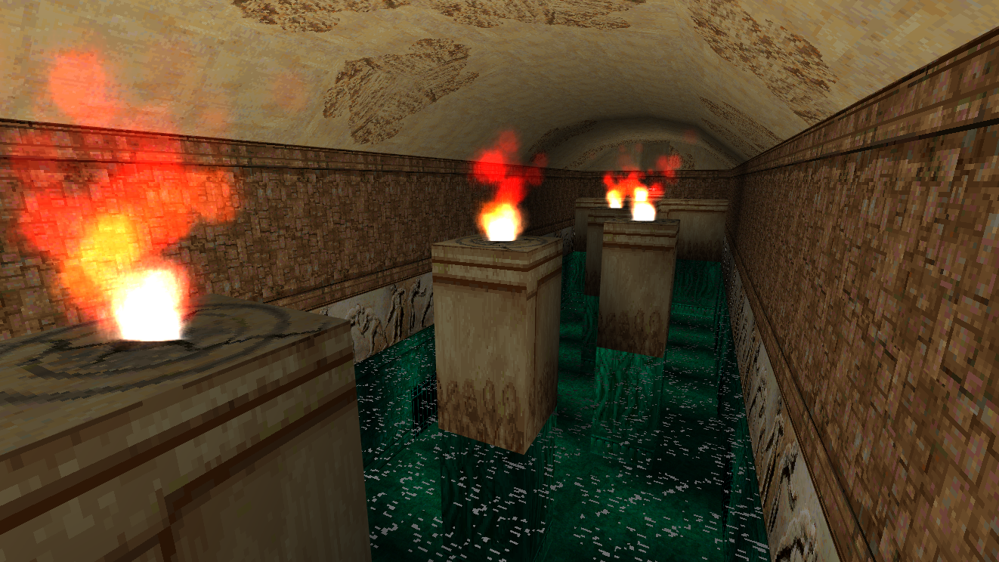
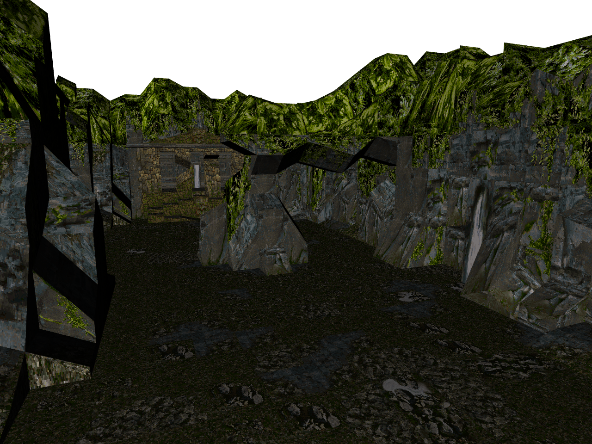
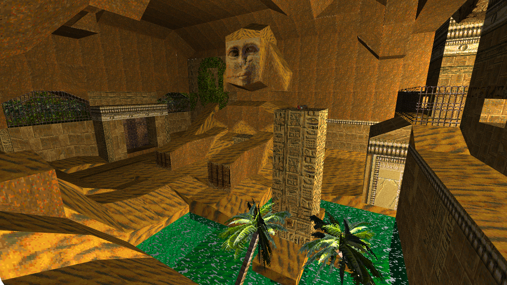
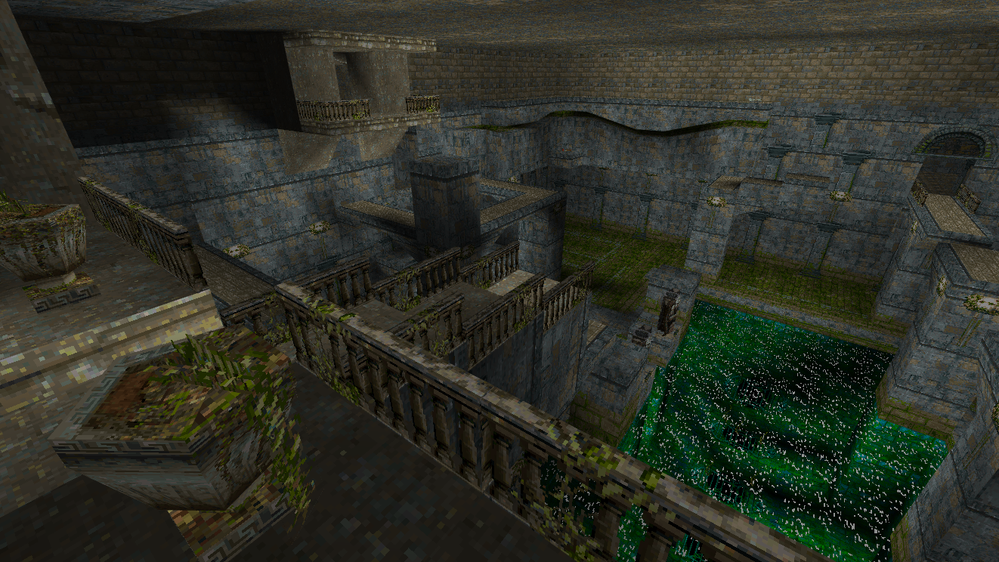

# 🗿 Tomb Viewer 🪙

This is WebGL based viewer / renderer for exploring and showing classic Tomb Raider levels in your browser, with no plugins or WASM nonsense.

It is written entirely in TypeScript with Vite.js and uses my own [GSOTS3D](https://github.com/benc-uk/gsots3d) library for all 3D rendering, it is a standalone static webapp and yeah... It works pretty damn well 🥰

Status:

- Tomb Raider 1 & 2 support only
- Level file parsing (for all the parts I need)
- Texture data loaded from level file
- Level geometry rendered with textures and normals
- Transparency and sprites
- Meshes for static scenery and single mesh entities (doors, traps etc)

 

Todo:

- Tomb Raider 3
- Tomb Raider 4 & 5 but unlikey
- Implement the whole game (absolutely not happening 🫠)

# 🌐 Try It

These whole thing is deployed to GitHub pages here, just be aware it is note mobile friendly at all!

### [code.benco.io/tomb-viewer](http://code.benco.io/tomb-viewer/)

Controls:

- Cursors keys or WASD to move
- Mouse to look around
- Keys '[' and ']' to move up & down
- Space bar to switch alt rooms
- 'H' to show the help

There are some options available by clicking the cog icon in the top right. More to be added later, the rest are in the config.jsonc file in the public folder

# 🤓 Running locally

Have Node.js installed, clone the repo, and run `npm run dev`, enjoy!

# 📜 References

This whole idea and project would have been completely impossible without the 'TRosettaStone 3' (aka TRS or TRS3) document
https://opentomb.github.io/TRosettaStone3/trosettastone.html

Which is also available here
https://trwiki.earvillage.net/doku.php?id=trs

The source of trview was consulted for reference purposes https://github.com/chreden/trview
