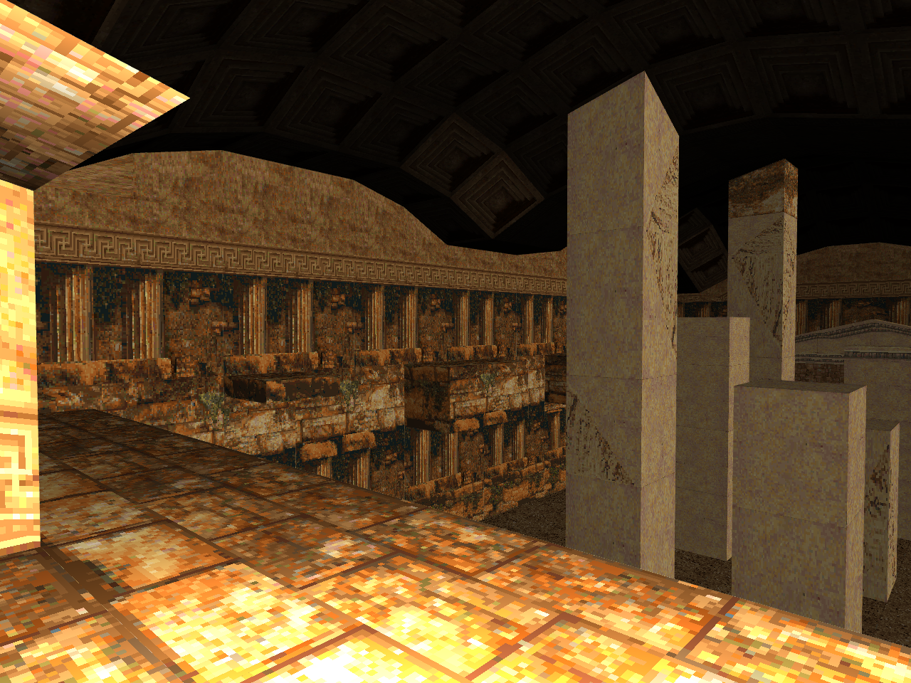
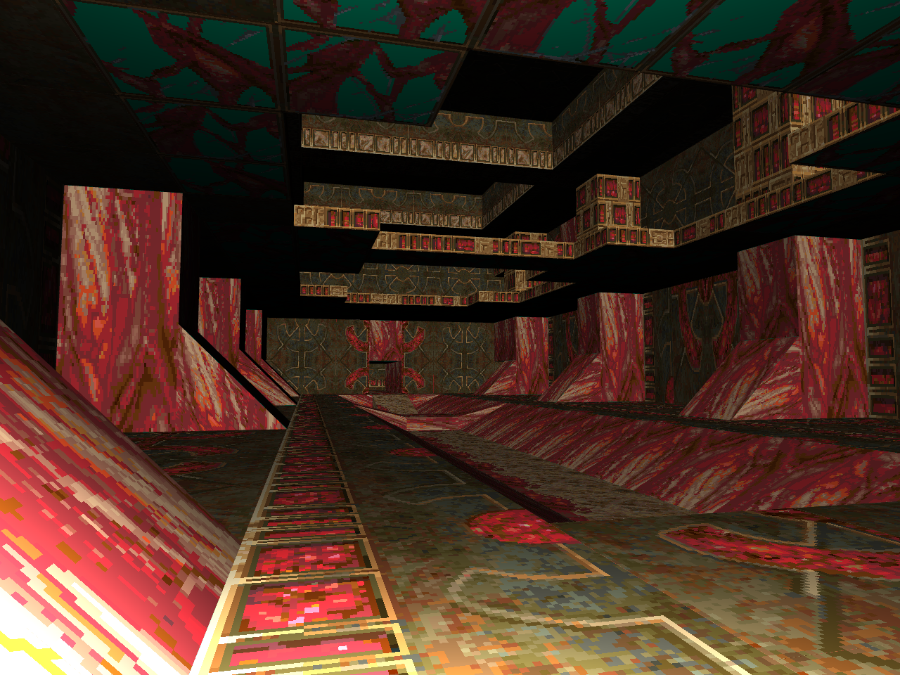
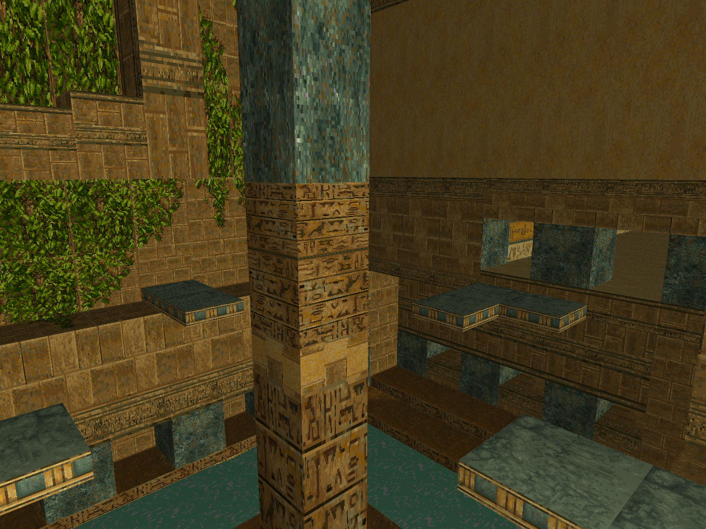

# Tomb Viewer

This is an attempt to develop a WebGL based viewer and renderer for classic Tomb Raider levels.

It is written in TypeScript with Vite and uses my [GSOTS3D](https://github.com/benc-uk/gsots3d) library, it is a standalone static webapp.

Status:

- Tomb Raider 1 support only
- Level file parsing
- Texture data loaded from level file
- Level geometry rendered with correct textures and normals

# Try It

The app is deployed to GitHub pages:

### [code.benco.io/tomb-viewer/](http://code.benco.io/tomb-viewer/)

Controls:

- Cursors keys or WASD to move
- Mouse to look around
- Keys '[' and ']' to move up & down

# Status

 

# References

Would simply been impossible without the 'TRosettaStone 3' (aka TRS or TRS3)
https://opentomb.github.io/TRosettaStone3/trosettastone.html

Also available here
https://trwiki.earvillage.net/doku.php?id=trs
