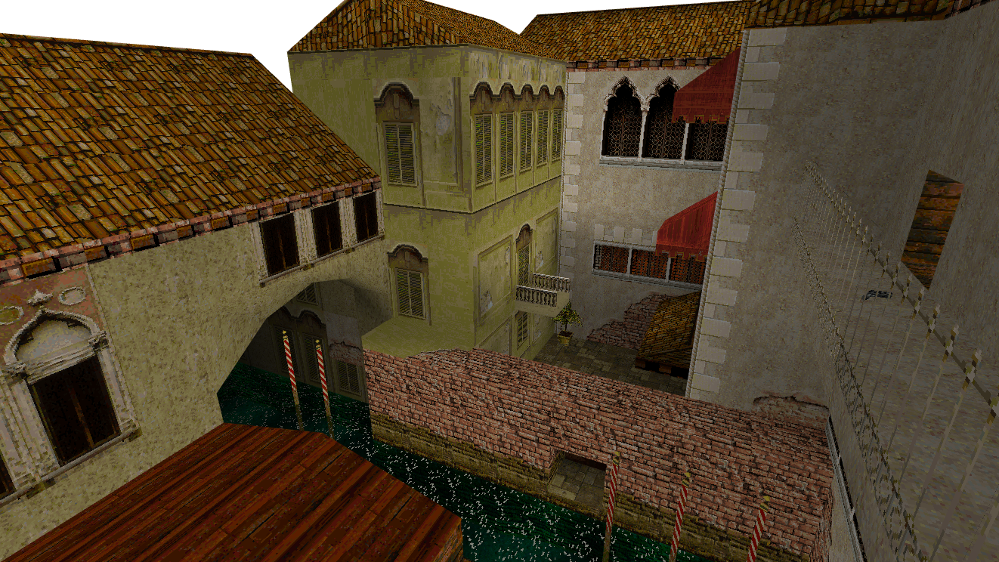
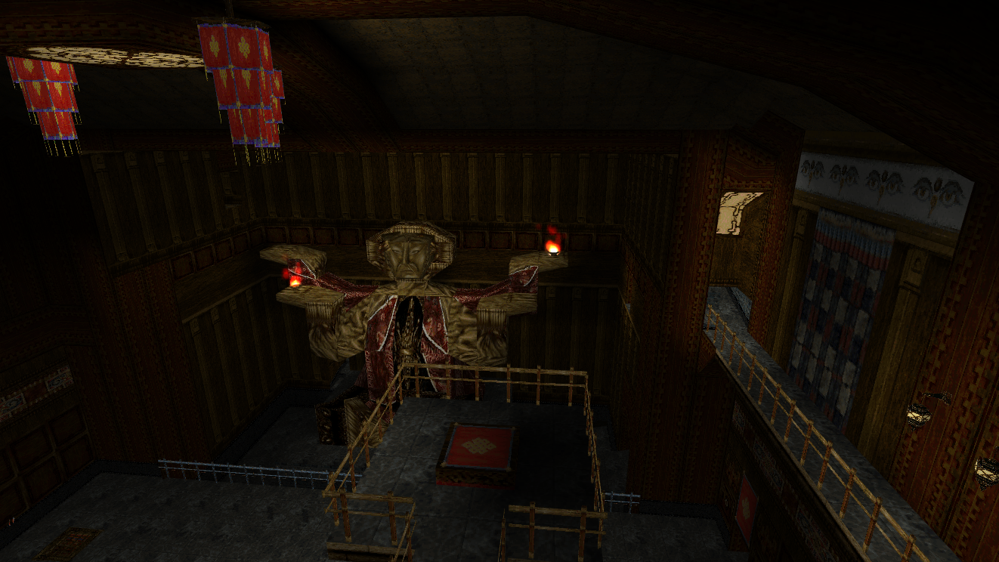

# 🗿 Tomb Viewer 🪙

This is WebGL based viewer / renderer for exploring and showing classic (Core Design games 1-5) Tomb Raider levels in your browser, with no plugins or WASM nonsense.

It is written entirely in TypeScript with Vite.js and uses my own [GSOTS3D](https://github.com/benc-uk/gsots3d) library for all 3D rendering, it is a standalone static webapp and yeah... It works pretty damn well 🥰

Status:

- Tomb Raider 1 ~ 3
- Level file parsing (for all the parts I need)
- Texture data loaded from level file
- Level geometry rendered with textures and normals
- Transparency and sprites
- Dynamic effects for water, particles and flames
- Meshes for static scenery and single mesh entities (doors, traps etc)

 

See [screens directory for more](./screens/)

Todo:

- Skyboxes
- Multi-part meshes
- Fix water textures in TR3 - Isn't going to happen
- Fix animated textures in TR3 - Isn't going to happen
- Tomb Raider 4 & 5 suppoer - Phenomenally unlikely
- Implement the whole game (absolutely not happening 🫠)

# 🌐 Try It

These whole thing is deployed to GitHub pages here, just be aware it is note mobile friendly at all!

### [code.benco.io/tomb-viewer](http://code.benco.io/tomb-viewer/)

Controls:

- Cursors keys or WASD to move
- Mouse to look around
- Keys '[' and ']' to move up & down
- Space bar to switch alt rooms
- 'H' to show the help

There are some options available by clicking the cog icon in the top right.

# 🤓 Running locally

Have Node.js installed, clone the repo, and run `npm run dev`, enjoy!

# 📜 References

This whole idea and project would have been completely impossible without the 'TRosettaStone 3' (aka TRS or TRS3) document
https://opentomb.github.io/TRosettaStone3/trosettastone.html

Which is also available here
https://trwiki.earvillage.net/doku.php?id=trs

The source of trview was consulted for reference purposes https://github.com/chreden/trview
